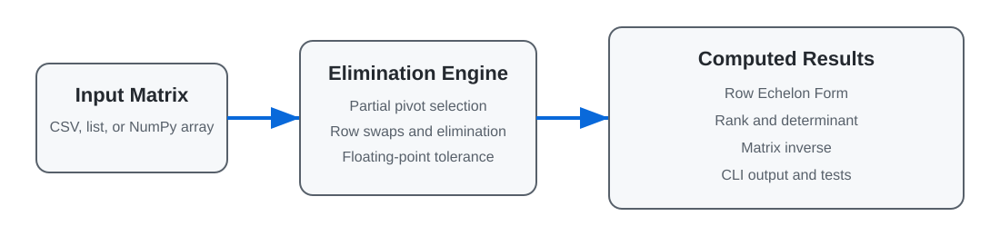

# Echelon Matrix Algorithms

[](https://github.com/shaharnahumswe-stack/echelon-matrix-algorithms/actions/workflows/tests.yml)


A scientific-programming project that implements fundamental linear-algebra
operations from first principles using **Gaussian elimination** and
**Gauss-Jordan elimination**.

The project contains a tested Python package, a command-line interface, a
Jupyter demonstration, and the original Haskell implementation. High-level
`numpy.linalg` algorithms are intentionally avoided in the core implementation
so the elimination process remains explicit and easy to study.

<p align="center">
  
</p>

## Key features

- Row Echelon Form (REF)
- Rank for square and rectangular matrices
- Determinant of square matrices
- Inverse of nonsingular square matrices
- Partial pivoting for improved numerical stability
- Configurable tolerance for near-zero pivots
- CSV-based command-line interface
- Automated tests across Python 3.10, 3.11, and 3.12
- Python and Haskell implementations

## Repository structure

```text
.
├── .github/workflows/       # Continuous-integration test workflow
├── assets/                  # README diagrams
├── docs/                    # Mathematical and design summary
├── examples/                # Example CSV matrix
├── haskell/                 # Original Haskell implementation
├── notebooks/               # Interactive Jupyter demonstration
├── src/echelon_matrix/      # Python package and CLI
├── tests/                   # Pytest suite
├── LICENSE
├── pyproject.toml
└── requirements.txt
```

## Quick start

Clone the repository and enter the project directory:

```bash
git clone https://github.com/shaharnahumswe-stack/echelon-matrix-algorithms.git
cd echelon-matrix-algorithms
```

Create and activate a virtual environment:

```bash
python -m venv .venv
```

```bash
# Windows
.venv\Scripts\activate

# macOS / Linux
source .venv/bin/activate
```

Install the package:

```bash
pip install -e .
```

Install the test dependency and run the tests:

```bash
pip install -e ".[dev]"
pytest -q
```

## Python example

```python
import numpy as np

from echelon_matrix import determinant, inverse, matrix_rank, row_echelon_form

matrix = np.array(
    [
        [1.0, 2.0, 3.0],
        [4.0, 5.0, 6.0],
        [7.0, 8.0, 10.0],
    ]
)

ref, rank, row_swaps = row_echelon_form(matrix)

print("REF:")
print(ref)
print("Rank:", rank)
print("Row swaps:", row_swaps)
print("Determinant:", determinant(matrix))
print("Inverse:")
print(inverse(matrix))
```

Expected determinant and rank:

```text
Determinant: -3.0
Rank: 3
```

## Command-line example

The package installs an `echelon-matrix` command that reads comma-separated
matrices:

```bash
echelon-matrix ref examples/matrix.csv
echelon-matrix rank examples/matrix.csv
echelon-matrix det examples/matrix.csv
echelon-matrix inverse examples/matrix.csv
```

For a singular matrix, the inverse command exits with a clear error rather
than returning an invalid result.

## Algorithm overview

### Gaussian elimination

1. Search the current column for the largest available absolute pivot.
2. Swap rows when needed.
3. Eliminate values below the pivot.
4. Continue until no additional pivot can be found.

The number of pivots gives the matrix rank. For a full-rank square matrix, the
determinant is the product of the diagonal entries after elimination, adjusted
for the parity of row swaps.

### Gauss-Jordan inversion

1. Construct the augmented matrix `[A | I]`.
2. Select and normalize each pivot.
3. Eliminate the pivot column above and below the pivot.
4. When the left side becomes the identity matrix, return the right side.
5. If a usable pivot cannot be found, report that the matrix is singular.

## Complexity

For a dense `n × n` matrix:

| Operation | Time | Auxiliary memory |
|---|---:|---:|
| Row echelon form | `O(n³)` | `O(n²)` |
| Determinant | `O(n³)` | `O(n²)` |
| Inverse | `O(n³)` | `O(n²)` |

## Testing

The test suite covers:

- rank of a rectangular matrix
- a determinant with a known result
- inverse validation through `A × A⁻¹ ≈ I`
- singular-matrix handling
- row swaps during pivoting
- invalid determinant input

GitHub Actions runs the test suite automatically on every push and pull
request.

## Numerical notes

- Floating-point results are approximate.
- A tolerance is used to treat very small pivots as zero.
- Partial pivoting improves stability, but this remains an educational
  implementation rather than a replacement for optimized numerical libraries.

## Project background

This project was originally developed for a scientific-programming course and
later reorganized into a portfolio-ready repository with packaging, tests,
documentation, a CLI, and continuous integration.

## Authors

- Shahar Nahum
- Arad Harush

## License

Distributed under the MIT License. See [`LICENSE`](LICENSE).
